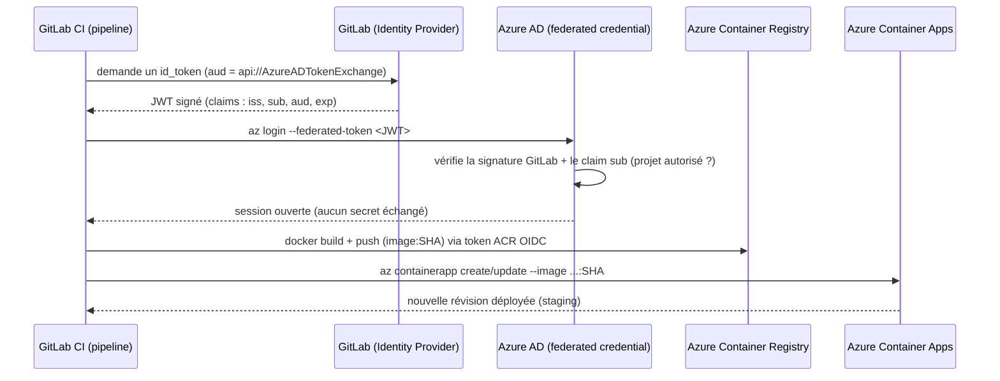

# Conteneuriser et déployer une application Python sur Azure (Melvin PETIT)

Une petite application Flask, conteneurisée avec Docker et déployée en continu sur
**Azure Container Apps** par un pipeline CI GitLab. Toute l'authentification Azure
est **sans secret** : le pipeline se connecte à Azure avec **OpenID Connect (OIDC)**,
donc aucun mot de passe, clé ou certificat n'est jamais stocké.

## Ce que fait ce dépôt

1. **L'application** (`app.py`) : un minuscule serveur Flask qui journalise chaque
   visite et expose le fichier de log.
2. **Conteneurisation** (`Dockerfile`, `Makefile`) : l'application tourne dans une
   image Docker, avec un volume pour ses logs.
3. **CI/CD** (`.gitlab-ci.yml`) : à chaque push l'image est construite et testée
   (smoke test) ; sur `main` elle est poussée vers **Azure Container Registry (ACR)**
   et l'application est déployée/mise à jour sur **Azure Container Apps (ACA)**.
4. **Bootstrap OIDC** (`scripts/`) : un script local exécuté une seule fois crée le
   minimum de confiance Azure dont la CI a besoin, puis la CI provisionne le reste
   de l'infrastructure elle-même.

## L'application

`app.py` est une application Flask avec deux routes :

- `GET /` , ajoute une ligne `<ip> - [<timestamp>] - GET / HTTP/1.1` à
  `data/access.log` et renvoie `Hello, world!`.
- `GET /logs` , renvoie le contenu de `data/access.log`.

Elle écoute sur `0.0.0.0:8080` et écrit ses logs dans `./data`, monté comme volume
Docker pour que les logs survivent aux redémarrages du conteneur.

```bash
$ python3 --version
Python 3.12.3
$ python app.py        # http://localhost:8080
```

## Organisation du dépôt

| Chemin | Rôle |
|------|------|
| `app.py` | Application Flask (routes `/` et `/logs`) |
| `requirements.txt`, `pylock.toml` | Dépendances Python (Flask) |
| `Dockerfile` | Construction de l'image (`python:3.14-slim`, port 8080, volume `/app/data`) |
| `Makefile` | Raccourcis Docker locaux (`build`, `run`, `restart`, `kill`) |
| `.gitlab-ci.yml` | Pipeline CI/CD (build → push → deploy) |
| `scripts/azure-setup.sh` | Bootstrap OIDC unique sur Azure (exécuté localement) |
| `scripts/azure-teardown.sh` | Vide le groupe de ressources Azure |
| `scripts/.env` | Configuration du bootstrap (identifiants uniquement, en clair) |
| `data/` | Logs d'exécution (`access.log`) |

## Lancer en local

Avec Docker directement :

```bash
docker build -t python-app .
docker run -p 8080:8080 python-app:latest   # http://localhost:8080
```

Ou avec le `Makefile`, qui encapsule les mêmes commandes et affiche un message de
succès/erreur clair (la sortie standard est envoyée vers `/dev/null`, les erreurs
sont conservées pour faciliter le débogage) :

- `make build` , construit l'image (`docker build`)
- `make run` , démarre l'application de zéro (`docker run`)
- `make restart` , redémarre sans perte de données (`docker restart`)
- `make kill` , arrête et supprime complètement le conteneur et son volume, **avec** perte de données

Les logs sont écrits dans le conteneur sous `/app/data`, persistés via le volume :

```bash
$ docker exec -it <container> sh
$ cat data/access.log
172.17.0.1 - [2026-06-23 08:33:21] - GET / HTTP/1.1
```

## Pipeline CI/CD

Le pipeline a trois étapes enchaînées ; chacune ne démarre que si la précédente
réussit.

| Étape | Branche | Ce qu'elle fait |
|-------|--------|--------------|
| `build` | toutes | Construit l'image et lance un smoke test (démarre le conteneur, puis l'arrête). Ne pousse rien. |
| `push` | `main` uniquement | Crée l'ACR si besoin, puis construit et pousse l'image (taguée avec le SHA du commit **et** `latest`). |
| `deploy` | `main` uniquement | Crée l'environnement ACA + l'application au premier passage, sinon met à jour l'image. Expose l'URL publique comme environnement GitLab `staging`. |

L'image est versionnée par l'identifiant court du commit (`$CI_COMMIT_SHORT_SHA`) :
un tag = un commit précis, donc on sait toujours ce qui tourne et on peut revenir à
une image immuable si un déploiement casse.

`push` et `deploy` ne s'exécutent que sur `main` car la confiance OIDC (voir plus
bas) est limitée à cette branche.

## Authentification sans secret : OpenID Connect (OIDC)

Politique d'entreprise : **aucun secret** dans la CI. L'authentification à Azure
utilise uniquement OIDC.

À chaque pipeline, GitLab émet un **JWT** (JSON Web Token) à courte durée de vie,
signé par GitLab. La CI présente ce token à Azure, configuré au préalable pour
**faire confiance** aux tokens venant de ce projet GitLab précis (une *federated
credential* sur une *managed identity*). Rien n'est stocké : il n'y a aucun secret
à voler, et un token intercepté expire presque immédiatement et n'est valable que
pour ce projet.

Un JWT a trois parties `header.payload.signature`. Les claims importants du payload :

- `iss` (issuer) , qui a émis le token (GitLab).
- `aud` (audience) , à qui il est destiné (`api://AzureADTokenExchange`).
- `sub` (subject) , d'où il provient exactement (projet / branche). C'est ce
  qu'Azure vérifie pour n'accepter que **notre** projet sur `main`.
- `exp` (expiration) , durée de vie courte.

Les identifiants Azure (`AZURE_CLIENT_ID`, `AZURE_TENANT_ID`,
`AZURE_SUBSCRIPTION_ID`, noms de ressources) sont gardés **en clair** dans le bloc
`variables` de `.gitlab-ci.yml`. Ce ne sont **pas des secrets** , ce sont des
identifiants publics, aucune authentification ne repose sur eux (c'est le JWT OIDC
qui authentifie). Ils pourraient tout aussi bien se trouver dans *Settings > CI/CD >
Variables*. L'URL publique de l'application n'est pas codée en dur : la CI la lit
après déploiement et l'expose comme environnement `staging` (URL dynamique via un
rapport `dotenv`).

## Architecture : la CI provisionne l'infra, sauf un bootstrap

Il y a un problème de l'œuf et de la poule. Pour que la CI se connecte à Azure sans
secret, une identité et une confiance fédérée doivent **déjà** exister sur Azure ,
mais les créer nécessite d'être authentifié. Ce minimum incompressible est la
**seule** chose qui ne peut pas venir de la CI.

Le découpage est donc :

- **Bootstrap local unique** (`scripts/azure-setup.sh`, exécuté par un Owner après
  `az login`) : groupe de ressources, resource providers, managed identity,
  federated credential (GitLab `main` → Azure) et les rôles au périmètre du RG
  (`Contributor` + `AcrPush` + `AcrPull`). Il affiche ensuite les identifiants à
  copier dans `.gitlab-ci.yml`.
- **Tout le reste est créé par la CI** : ACR, image, environnement ACA et
  application. Les commandes `az ... create` sont idempotentes, donc le pipeline se
  rejoue sans risque.

```bash
az login
./scripts/azure-setup.sh   # lit scripts/.env, à exécuter une seule fois
```

### Diagramme du flux OIDC



Version texte, au cas où Mermaid ne s'affiche pas :

```
GitLab CI ── demande un token ──▶ GitLab (issuer)
GitLab CI ◀── JWT signé (iss/sub/aud/exp) ── GitLab
GitLab CI ── az login --federated-token ──▶ Azure AD
                                            Azure AD vérifie signature + sub
GitLab CI ◀── session ouverte (0 secret) ── Azure AD
GitLab CI ── docker build + push (image:SHA) ─▶ ACR
GitLab CI ── az containerapp create/update ──▶ ACA (staging)
```

## Notes

**ACR Tasks interdit sur cette souscription.** `az acr build` (build côté serveur)
renvoie `TasksOperationsNotAllowed` ici. L'étape `push` construit donc l'image en
local avec docker-in-docker, récupère un token ACR éphémère via l'identité OIDC
(`az acr login --expose-token`), exécute `docker login` avec, puis `docker push` ,
toujours sans aucun secret stocké.

**Configuration.** La config du bootstrap (noms, région, souscription) se trouve
dans `scripts/.env`, versionnée en clair puisqu'il ne s'agit que d'identifiants ;
adaptez les valeurs pour une autre souscription/projet.

**Teardown.** `scripts/azure-teardown.sh` vide le groupe de ressources de toutes
ses ressources (Container Apps avant leur environnement, puis le reste), pratique
pour repartir d'un état propre. Il ne supprime pas l'identité OIDC, donc la CI peut
tout reprovisionner au passage suivant.
