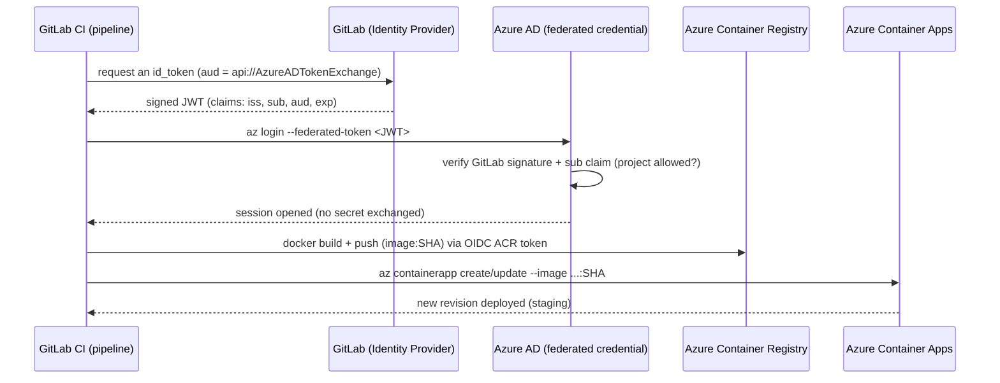

# Dockerize and deploy a Python app to Azure (Melvin PETIT)

A small Flask application, containerized with Docker and continuously deployed to
**Azure Container Apps** by a GitLab CI pipeline. The whole Azure authentication
is **secret-less**: the pipeline logs in to Azure with **OpenID Connect (OIDC)**,
so no password, key or certificate is ever stored.

## What this repo does

1. **The app** (`app.py`): a tiny Flask server that logs every visit and exposes
   the log file.
2. **Containerization** (`Dockerfile`, `Makefile`): the app runs in a Docker
   image, with a volume for its logs.
3. **CI/CD** (`.gitlab-ci.yml`): on every push the image is built and smoke
   tested; on `main` it is pushed to **Azure Container Registry (ACR)** and the
   app is deployed/updated on **Azure Container Apps (ACA)**.
4. **OIDC bootstrap** (`scripts/`): a one-time local script creates the minimal
   Azure trust the CI needs, then the CI provisions the rest of the infra itself.

## The application

`app.py` is a Flask app with two routes:

- `GET /` — appends a line `<ip> - [<timestamp>] - GET / HTTP/1.1` to
  `data/access.log` and returns `Hello, world!`.
- `GET /logs` — returns the content of `data/access.log`.

It listens on `0.0.0.0:8080` and writes its logs under `./data`, which is mounted
as a Docker volume so the logs survive container restarts.

```bash
$ python3 --version
Python 3.12.3
$ python app.py        # http://localhost:8080
```

## Repository layout

| Path | Role |
|------|------|
| `app.py` | Flask application (routes `/` and `/logs`) |
| `requirements.txt`, `pylock.toml` | Python dependencies (Flask) |
| `Dockerfile` | Image build (`python:3.14-slim`, port 8080, volume `/app/data`) |
| `Makefile` | Local Docker shortcuts (`build`, `run`, `restart`, `kill`) |
| `.gitlab-ci.yml` | CI/CD pipeline (build → push → deploy) |
| `scripts/azure-setup.sh` | One-time OIDC bootstrap on Azure (run locally) |
| `scripts/azure-teardown.sh` | Empties the Azure resource group |
| `scripts/.env` | Bootstrap config (identifiers only, in clear) |
| `data/` | Runtime logs (`access.log`) |

## Run locally

With Docker directly:

```bash
docker build -t python-app .
docker run -p 8080:8080 python-app:latest   # http://localhost:8080
```

Or with the `Makefile`, which wraps the same commands and prints a clear
success/error message (stdout is sent to `/dev/null`, errors are kept for easy
debugging):

- `make build` — build the image (`docker build`)
- `make run` — start the app from scratch (`docker run`)
- `make restart` — restart without data loss (`docker restart`)
- `make kill` — stop and fully remove the container and its volume, **with** data loss

The logs are written inside the container under `/app/data`, persisted through the
volume:

```bash
$ docker exec -it <container> sh
$ cat data/access.log
172.17.0.1 - [2026-06-23 08:33:21] - GET / HTTP/1.1
```

## CI/CD pipeline

The pipeline has three chained stages; each starts only if the previous one
succeeds.

| Stage | Branch | What it does |
|-------|--------|--------------|
| `build` | all | Builds the image and runs a smoke test (start the container, then stop it). Pushes nothing. |
| `push` | `main` only | Creates the ACR if needed, then builds and pushes the image (tagged with the commit SHA **and** `latest`). |
| `deploy` | `main` only | Creates the ACA environment + app on first run, otherwise updates the image. Exposes the public URL as the GitLab `staging` environment. |

The image is versioned by the short commit ID (`$CI_COMMIT_SHORT_SHA`): one tag =
one precise commit, so you always know what is running and can roll back to an
immutable image if a deployment breaks.

`push` and `deploy` only run on `main` because the OIDC trust (see below) is
limited to that branch.

## Secret-less authentication: OpenID Connect (OIDC)

Company policy: **no secret** in the CI. Authentication to Azure uses OIDC only.

On every pipeline, GitLab issues a short-lived **JWT** (JSON Web Token) signed by
GitLab. The CI presents this token to Azure, which was configured beforehand to
**trust** tokens coming from this specific GitLab project (a *federated
credential* on a *managed identity*). Nothing is stored: there is no secret to
steal, and an intercepted token expires almost immediately and is only valid for
this project.

A JWT has three parts `header.payload.signature`. The important payload claims:

- `iss` (issuer) — who issued the token (GitLab).
- `aud` (audience) — who it is for (`api://AzureADTokenExchange`).
- `sub` (subject) — exactly where it comes from (project / branch). This is what
  Azure checks to accept only **our** project on `main`.
- `exp` (expiration) — short lifetime.

The Azure identifiers (`AZURE_CLIENT_ID`, `AZURE_TENANT_ID`,
`AZURE_SUBSCRIPTION_ID`, resource names) are kept **in clear** in the `variables`
block of `.gitlab-ci.yml`. These are **not secrets** — they are public
identifiers, no authentication relies on them (the OIDC JWT is what
authenticates). They could equally live in *Settings > CI/CD > Variables*. The
app's public URL is not hardcoded: the CI reads it after deployment and exposes
it as the `staging` environment (dynamic URL via a `dotenv` report).

## Architecture: the CI provisions the infra, except one bootstrap

There is a chicken-and-egg problem. For the CI to connect to Azure without a
secret, an identity and a federated trust must **already** exist on Azure — but
creating them requires being authenticated. That irreducible minimum is the
**only** thing that cannot come from the CI.

So the split is:

- **One-time local bootstrap** (`scripts/azure-setup.sh`, run by an Owner after
  `az login`): resource group, resource providers, managed identity, federated
  credential (GitLab `main` → Azure) and the RG-scoped roles
  (`Contributor` + `AcrPush` + `AcrPull`). It then prints the identifiers to copy
  into `.gitlab-ci.yml`.
- **Everything else is created by the CI**: ACR, image, ACA environment and app.
  The `az ... create` commands are idempotent, so the pipeline replays safely.

```bash
az login
./scripts/azure-setup.sh   # reads scripts/.env, run only once
```

### OIDC flow diagram



Text version, in case Mermaid does not render:

```
GitLab CI ── request a token ──▶ GitLab (issuer)
GitLab CI ◀── signed JWT (iss/sub/aud/exp) ── GitLab
GitLab CI ── az login --federated-token ──▶ Azure AD
                                            Azure AD verifies signature + sub
GitLab CI ◀── session opened (0 secret) ── Azure AD
GitLab CI ── docker build + push (image:SHA) ─▶ ACR
GitLab CI ── az containerapp create/update ──▶ ACA (staging)
```

## Notes

**ACR Tasks forbidden on this subscription.** `az acr build` (server-side build)
returns `TasksOperationsNotAllowed` here. The `push` stage therefore builds the
image locally with docker-in-docker, gets an ephemeral ACR token via the OIDC
identity (`az acr login --expose-token`), runs `docker login` with it, then
`docker push` — still without any stored secret.

**Configuration.** The bootstrap config (names, region, subscription) lives in
`scripts/.env`, versioned in clear since these are only identifiers; adapt the
values there for another subscription/project.

**Teardown.** `scripts/azure-teardown.sh` empties the resource group of all its
resources (Container Apps before their environment, then the rest), handy to
start from a clean state. It does not delete the OIDC identity, so the CI can
re-provision everything on the next run.
