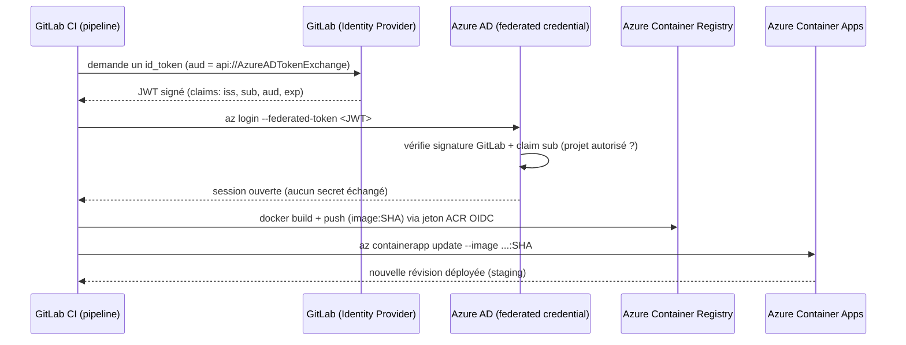

# Melvin PETIT : Dockeriser une app Python

## Step 1 (~30mn) : Faire un **fork** public de l'application, sur votre propre compte Gitlab

J'ai forké le projet sur mon compte gitlab :
https://gitlab.com/WhiteMuush/melvin-petit-simplon-22-pyweb

## Step 2 (~30mn) : `git clone` le nouveau repository sur votre machine (VM, WSL, Mac)

J'ai créé une clé ssh nommée `gitlab`, j'ai copié la clé publique sur mon compte gitlab, j'ai cloné le repo en ssh.

## Step 3 (~15mn) : Installer Python sur votre machine

Python3 était déjà installé sur mon wsl :

```bash
$ python3 --version
Python 3.12.3
```

## Step 5 (~15mn) : Lancer l'application sur son PC, sans docker (`python app.py`)

L'application se lance correctement, montrant une page blanche avec écrit "hello, world!".

## Step 6 (~30mn) : Accéder à l'application depuis votre navigateur, puis explorer les logs générés dans le dossier `data`

```bash
$ cd data
$ ls
access.log
$ cat access.log
172.26.176.1 - [2026-06-23 09:29:05] - GET / HTTP/1.1
```

## Step 7 : Apprécier ce moment où tout fonctionne, car il ne va pas durer

SYMPA !

## Step 8 (~3h) : Écrire un `Dockerfile` qui décrira l'image Docker de notre application, première étape cruciale de la conteneurisation !

https://www.geeksforgeeks.org/python/setting-up-docker-for-python-projects-a-step-by-step-guide/

```bash
docker build -t python-app .
docker run -p 8080:8080 python-app:latest
```

Accessible sur `localhost:8080`.

Pour le volume :

```bash
$ docker ps
CONTAINER ID   IMAGE               COMMAND                  CREATED         STATUS         PORTS                                         NAMES
ef2f74677880   python-app:latest   "python app.py host=…"   6 minutes ago   Up 5 minutes   0.0.0.0:8080->8080/tcp, [::]:8080->8080/tcp   charming_jang

$ docker exec -it ef2f74677880 sh
$ ls
app  app.py  data  requirements.txt
$ cd data
$ ls
access.log
$ cat access.log
172.17.0.1 - [2026-06-23 08:33:21] - GET / HTTP/1.1
172.17.0.1 - [2026-06-23 08:33:22] - GET / HTTP/1.1
172.17.0.1 - [2026-06-23 08:33:22] - GET / HTTP/1.1
172.17.0.1 - [2026-06-23 08:33:22] - GET / HTTP/1.1
172.17.0.1 - [2026-06-23 08:33:24] - GET / HTTP/1.1
```

## Step 10 (~1h30) : Écrire un Makefile pour les commandes ci-dessus (voir le barème)

Un Makefile permet d'effectuer ces étapes sans effort. Commandes attendues :

- `make run` : pour lancer l'application de 0 (`docker run`)
- `make build` : pour construire l'image (`docker build`)
- `make restart` : pour redémarrer l'application, sans perte de données !! (`docker stop` + `docker start`)
- `make kill` : pour arrêter et supprimer les conteneurs entièrement, AVEC perte de données (`docker rm` + `docker volume rm`)

J'ai fait toutes les demandes. Pour éviter de faire un retour dans la console à chaque fois, j'envoie le retour dans `/dev/null`, remplacé le retour par un `if/else` qui permettra d'avoir un message clair et précis. Pour les erreurs, elles sont retournées telles quelles pour avoir une trace plus simple à débuger.

## GitLab CI

Je l'ai fait sur un seul job, build run & test. On utilise la dernière version de docker actuelle sans utiliser `latest` par règle de sécurité. Le service docker-in-docker car le runner tourne sur un docker, donc il faut un système pour exécuter du docker dans du docker.

## Déploiement sur Azure (ACR + ACA) avec OIDC

La CI a maintenant 3 stages enchaînés : `build` (test de fumée), `push` (crée l'ACR si besoin, puis build + push de l'image), `deploy` (crée l'environment + la Container App au premier passage, sinon met à jour l'image). Un stage ne démarre que si le précédent réussit. Les stages `push` et `deploy` ne tournent que sur `main` (la confiance OIDC est limitée à cette branche).

C'est la CI elle-même qui crée l'infrastructure (ACR, environment, Container App), pas un script à part : une fois connectée à Azure en OIDC, elle a le rôle `Contributor` sur le resource group et provisionne tout. Les commandes `az ... create` sont idempotentes, donc le pipeline rejoue sans casser l'existant.

L'image est versionnée par l'ID du commit (`$CI_COMMIT_SHORT_SHA`) : un tag = un commit précis, ce qui permet de savoir exactement quel code tourne et de revenir en arrière (rollback) sur une image immuable si un déploiement casse.

### Authentification sans secret : OpenID Connect (OIDC)

Politique de l'entreprise : **aucun secret** dans la CI (pas de mot de passe, certificat ou clé). On s'authentifie à Azure uniquement avec OIDC.

Le principe : GitLab fabrique à chaque pipeline un **JWT** (JSON Web Token), une carte d'identité signée par GitLab et valable quelques minutes. La CI présente ce jeton à Azure. Azure a été configuré au préalable pour **faire confiance** aux jetons venant de ce projet GitLab précis (confiance fédérée / *federated credential* sur une *managed identity*). Aucun secret n'est stocké : rien à voler, et un jeton intercepté expire quasi immédiatement et ne vaut que pour ce projet.

Un JWT a 3 parties `header.payload.signature`. Champs importants du payload (*claims*) :

- `iss` (issuer) : qui a émis le jeton (GitLab).
- `aud` (audience) : à qui il est destiné (`api://AzureADTokenExchange` pour Azure).
- `sub` (subject) : d'où il vient précisément (le projet / la branche). C'est ce qu'Azure vérifie pour n'accepter que **notre** projet.
- `exp` (expiration) : durée de vie courte du jeton.

Les identifiants Azure (`AZURE_CLIENT_ID`, `AZURE_TENANT_ID`, `AZURE_SUBSCRIPTION_ID`, noms des ressources) sont mis en clair dans le bloc `variables` du `.gitlab-ci.yml`. Ce **ne sont pas des secrets** : ce sont des identifiants publics, aucune authentification ne repose dessus (c'est le JWT OIDC qui authentifie). On pourrait aussi les placer dans Settings > CI/CD > Variables, c'est équivalent. L'URL publique de l'app n'est pas codée en dur : la CI la récupère après déploiement et l'expose à GitLab comme environnement `staging` (URL dynamique via rapport `dotenv`).

### Le bootstrap OIDC : le seul morceau hors CI

Il y a un œuf et la poule : pour que la CI se connecte à Azure sans secret, il faut qu'une identité (managed identity) et une confiance fédérée existent **déjà** côté Azure. Or les créer demande d'être déjà authentifié. Ce minimum ne peut donc pas venir de la CI, il se fait **une seule fois en local** (`az login`, par un Owner) avec `scripts/azure-setup.sh` : resource group, providers, managed identity, federated credential (GitLab `main` → Azure) et les rôles au scope du RG (`Contributor` + `AcrPush` + `AcrPull`). Le script affiche ensuite les identifiants à reporter dans le `.gitlab-ci.yml`. Tout le reste (ACR, image, environment, Container App) est créé par la CI.

```bash
az login
./scripts/azure-setup.sh   # lit scripts/.env, à lancer une seule fois
```

### Schéma du flux OIDC



Version texte du même flux, au cas où le rendu Mermaid ne s'affiche pas :

```
GitLab CI ── demande un token ──▶ GitLab (émetteur)
GitLab CI ◀── JWT signé (iss/sub/aud/exp) ── GitLab
GitLab CI ── az login --federated-token ──▶ Azure AD
                                            Azure AD vérifie signature + sub
GitLab CI ◀── session ouverte (0 secret) ── Azure AD
GitLab CI ── docker build + push (image:SHA) ─▶ ACR
GitLab CI ── az containerapp update ───────▶ ACA (staging)
```

### ACR Tasks interdit sur l'abonnement

`az acr build` (build côté serveur via ACR Tasks) est bloqué sur cet abonnement (`TasksOperationsNotAllowed`). Le stage `push` construit donc l'image en local avec docker-in-docker, récupère un jeton ACR éphémère via l'identité OIDC (`az acr login --expose-token`), fait un `docker login` avec ce jeton, puis `docker push`. Toujours sans secret stocké.

La configuration du bootstrap (noms, région, abonnement) est lue dans `scripts/.env`, versionné en clair car ce ne sont que des identifiants ; pour un autre abonnement/projet, il suffit d'y adapter les valeurs. `scripts/azure-teardown.sh` fait l'inverse du provisionnement : il vide le resource group de toutes ses ressources (Container Apps avant leur environnement, puis le reste), pratique pour repartir d'un état propre (il ne supprime pas l'identité OIDC si on souhaite la conserver, à ajuster selon le besoin).
